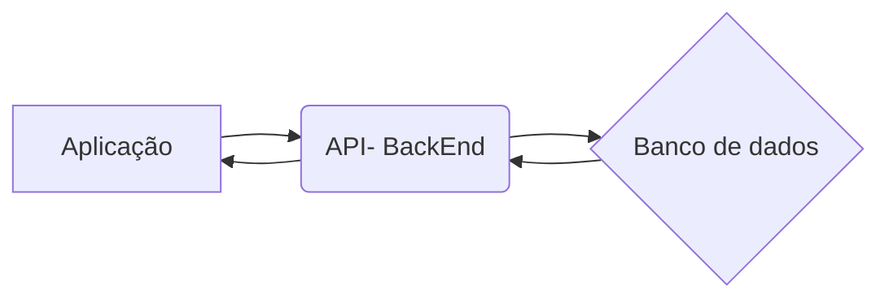

# ATIVYdades diárias
Este é um desafio técnico realizado com o intuito de ocupar a vaga de desenvolvedor jr na Ativy.

## TABELA DE CONTEÚDOS
<!--ts-->
  * [Detalhes do Projeto](#detalhes-do-projeto)
	  * [Case](#case)
	  * [Requisitos Técnicos](#requisitos-técnicos-ou-stacks-utilizadas)
	  * [Funcionalidades](#funcionalidades)
	  * [Estrutura](#estrutura)
		  * [Frontend](#frontend)
 		  * [Backend](#backend)
	  * [Desenvolvimento](#desenvolvimento)
		  * [Como Foi Feito](#como-foi-feito)
 		  * [Próximos Passos](#próximos-passos)
  * [Softwares Utilizados](#softwares-e-ferramentas-utilizadas)
  * [Referências](#referências)
  * [Sobre Mim](#sobre-mim)
<!--te-->

## DETALHES DO PROJETO

### CASE
Elaborar um projeto full stack, ou seja, uma aplicação que contenha backend e frontend. Neste caso, a aplicação é uma lista de tarefas que conta com tela de login,  tela de cadastro, tela com lista de atividades onde é possível ler, criar, alterar e deletar atividades relacionadas a um usuário  específico, notificando-o sempre que alguma alteração for realizada.

### REQUISITOS TÉCNICOS OU STACKS UTILIZADAS
Backend
- Node com TypesCript
- Express
- Banco de dados NoSQL (MongoDb)*
- Arquitetura MSC (Model - Service - Controller)
- Conceitos de Clean Code

FrontEnd
- React.js
- styledComponents

##
### FUNCIONALIDADES
O projeto conta com um CRUD básico, onde é possível:
**para usuários:**
* Inserir um novo usuário no banco de dados;
* Ler um usuário individualmente utilizando validação de permissão de leitura, através de token jwt
* Deletar um usuário individualmente através de validação.

**para tarefas:**
Todas as informações de tarefas estão diretamente atreladas a um usuário, por esse motivo, todos os eventos relacionados a elas, passarão por validação de token, para que somente o usuário que a criou tenha acesso e possa realizar alterações nela.

* Inserir uma nova tarefa.
* Listar tarefas.
* Listar uma tarefa específica.
* Atualizar tarefa.
* Deletar uma tarefas.
* Deletar todas tarefas.

*CRUD = (create - read - update - delete)* ou *(criar-ler-atualizar-deletar)*

##
### ESTRUTURA
O projeto está estruturado em dois módulos, frontend e backend. aqui estão os links de cada um deles, falando mais sobre a estrutura de pastas e documentação para uso.

FRONTEND
BACKEND

##
### DESENVOLVIMENTO

#### COMO FOI FEITO
A princípio tentei pensar em escala macro, como seria a aplicação de forma completa, sendo assim fiz um breve rascunho no papel, pensando como seria as telas da aplicação e o que ela precisaria para funcionar conforme o esperado.

Iniciei o desenvolvimento pela parte de backend, por acreditar que seria a parte mais desafiadora. Escolhi fazer a aplicação em Node.js com typescript, que aprendi recentemente e venho colocando em prática a fim de melhorar a minha qualidade de desenvolvimento. 

Comecei realizando a instalação das dependências necessárias as configurações inicias de ambiente. Logo após, iniciei o desenvolvimento da aplicação em si, até certo momento estava pensando em utilizar como sistema de persistência de dados o SQL, que neste caso, faria super sentido, porém, acabei optando por noSQL por questões de burocracia. Como ainda não tinha trabalhado com Typescript e SQL, depois de algumas horas estudando e tentando aplicar o uso do Sequelize como ORM, me deparei com muitos problemas, que demandaria muito tempo para resolver com o conhecimento que possuo atualmente, como este é um projeto que possui um prazo determinado, pensei em outras possibilidades, uma delas seria migrar ou iniciar um novo projeto em Node.js com javascript, que já utilizei antes e teria mais segurança para executá-lo. Porém, preferi manter o Typescript e alterar a forma de persistência de dados para noSQL e futuramente adicionar o TypeORM que encontrei em algumas pesquisas para configurar um banco SQL na aplicação, até para estudos futuros.

Depois de finalmente definida a forma de persistência de dados, parti para as regras de negócio. Criei uma aplicação seguindo alguns conceitos de solid e boas práticas de programação, ainda estou estudando e tenho muito a melhorar, mas venho colocando em prática o máximo possível, sempre visando uma aplicação que tenha possibilidade de escalar e que possua baixa acoplagem. Meu objetivo é fazer com que cada parte do código tenha somente uma responsabilidade, por isso, modularizo o máximo possível, com o objetivo de fazer com que seja mais fácil a manutenção e também melhorar/ aumentar a reusabilidade de código.

Segui uma estrutura de camadas chamada MSC (models,services,controllers) onde a camada de modelo é a camada responsável por lidar diretamente com o banco de dados, a camada de serviço lida com todas as regras de negócios e a camada de controle é responsável por lidar com a "comunicação" com o cliente que neste caso será o frontend que irá consumir.

##
#### PRÓXIMOS PASSOS
Pretendo realizar o teste de toda a aplicação a fim de minimizar a possibilidade de erro e amplificar a manutenibilidade da aplicação

##
### CONCLUSÃO
Ainda ex

## SOFTWARES E FERRAMENTAS UTILIZADAS

- [Visual Code Studio](https://code.visualstudio.com/) - O Visual Studio Code é um editor de código-fonte desenvolvido pela Microsoft para Windows, Linux e macOS. Ele inclui suporte para depuração, controle de versionamento Git incorporado, realce de sintaxe, complementação inteligente de código, snippets e refatoração de código. [1.64.2]

- [Npm](https://www.npmjs.com/) - É um gerenciador de pacotes para o Node.JS npm, Inc. é uma subsidiária do GitHub, que fornece hospedagem para desenvolvimento de software e controle de versão com o uso do Git. npm é o gerenciador de pacotes padrão para o ambiente de tempo de execução JavaScript Node.js

- [Node.js]((https://nodejs.org/)) - Node.js é um software de código aberto, multiplataforma, baseado no interpretador V8 do Google e que permite a execução de códigos JavaScript fora de um navegador web. [14 ou superior].

## REFERÊNCIAS

#### Os links abaixo contém alguns sites e fóruns, que serviram de referência para a elaboração do desafio.
- [Trybe](https://www.betrybe.com/)
- [HackerRank](https://www.hackerrank.com/)
- [Mozila ](https://developer.mozilla.org/pt-BR/docs/Web/JavaScript)
- [Fórum Stack Overflow](https://stackoverflow.com/)
- [w3schools](https://www.w3schools.com/jsref/default.asp)
- [electronics-tutorials](https://www.electronics-tutorials.ws/blog/7-segment-display-tutorial.html)

## Sobre Mim
[Linkedin](https://www.linkedin.com/in/fabiojuvenalpereira/)
[GitHub](https://github.com/fabiojuvenalpereira)
fabiojuvenalpereira@gmail.com

## COMO INSTALAR

  

Para conseguir instalar e fazer com que o código execute em seu computador, você vai precisar seguir alguns

requisitos.

  

Primeiro você precisará de ter os softwares utilizados para criar instalados em sua máquina, mas não se preocupe você poderá encontrá-los na seção de softwares e ferramentas utilizadas, que é esta [aqui](#softwares-e-ferramentas-utilizadas). As versões dos softwares que utilizei, estão logo ao final da síntese, contidas entre colchetes assim como neste exemplo: **[1.64.2]**.

  

Tendo os softwares instalados em sua máquina você precisará realizar os seguintes passos:

##

### Você precisará de clonar o repositório em sua máquina, para isso utilize o seguinte comando:

####

git clone git@github.com:fabiojuvenalpereira/EbytrProject.git

### Depois você precisará entrar na pasta que será criada em seu computador, utilizando o seguinte comando:

####

cd EbyrtProject

##

### Agora, precisaremos instalar as dependências necessárias nos módulos do projeto:

  

### Primeiro, vamos instalar as dependências necessárias do módulo de front end:

Para isso vamos entrar na pasta chamada frontend, utilizando o seguinte comando:

cd frontend

  

Logo depois, precisaremos realizar o comando para baixar e instalar as dependências para o projeto.

  

npm install

##

### Depois de instaladas as dependências do módulo de front, vamos instalar as dependências do módulo de backend.

Para isso, precisaremos de voltar para a pasta principal da aplicação, logo em seguida entrar na pasta do módulo de backend.

cd ../backend

  

Em seguida, realizar o comando para baixar e instalar as dependências.

npm install

##

  

### Depois de instaladas as dependências em ambos os módulos, para executarmos de fato o projeto em localhost,

precisaremos de usar dois terminais, um para o front end e outro para o back end.

  

Caso esteja utilizando o vscode, é só clicar no menu superior `Terminal`, `Novo Terminal`.

Certifique-se que você esteja na pasta raiz do projeto, ou seja, na pasta EbyrtProject.

  

Em um terminal execute o comando.

  

cd backend

  

Logo em seguida, execute o comando.

  

npm run dev

*Certifique se que o MongoDb esteja rodando localmente

Se tudo aconteceu conforme o esperado, no terminal deve aparecer uma mensagem dizendo que a aplicação foi iniciada na porta `localhost:3001`.

Em um terminal execute o comando.

  

cd frontend

Logo em seguida, execute o comando.

npm start

  

Se tudo estiver ocorrido conforme o esperado, no terminal deve aparecer uma mensagem dizendo que a aplicação foi iniciada na porta `localhost:3000` e você será redirecionado para seu navegador. Visualizando a tela principal da aplicação. Caso isso não aconteça, você poderá tentar digitar em seu navegador o seguinte link:

  

http://localhost:3000/

  

## COMO FUNCIONA

##### Desenho simbólico do armazenamento de dados realizado no banco de dados:

| _id |userName |task | date |
|-----|---------|-----------------------|-----------------------|
| 1 | Xablau | Beber água | 14/02/2022 - 14:00:01 |
| 2 | Xablau | Terminar a série | 14/02/2022 - 14:50:00 | 
 

##### Simbolização da rota realizada pela aplicação:

##
